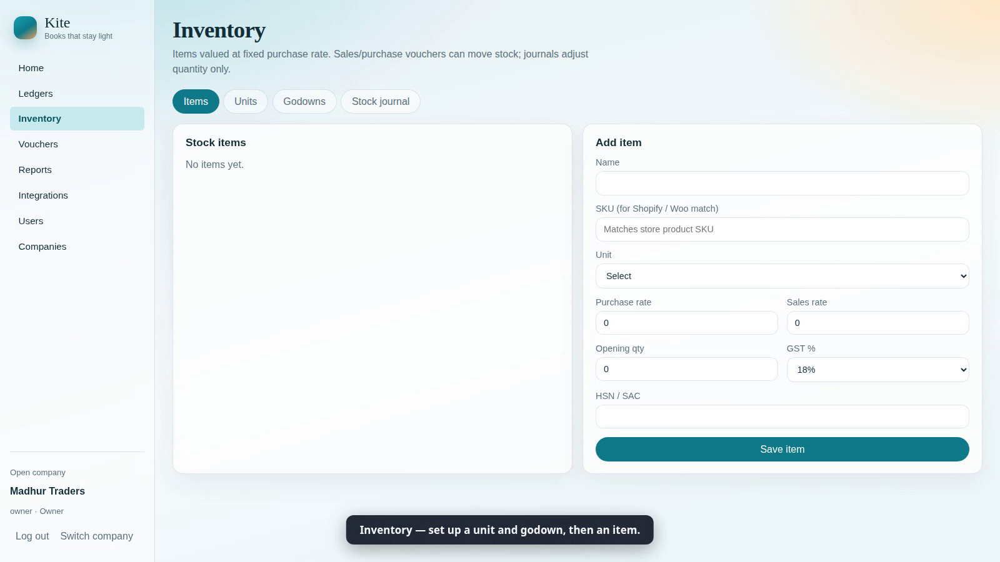
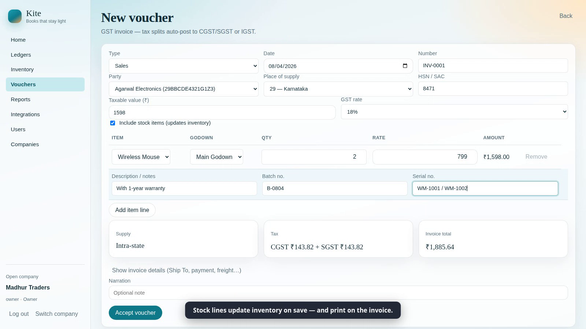
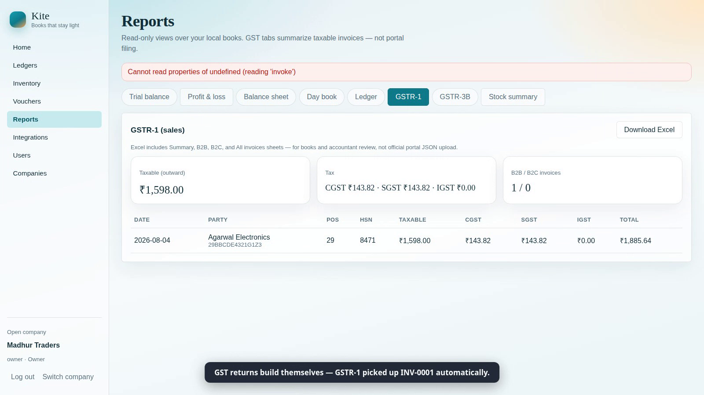

# Kite

[](https://github.com/taksha17/kite/actions/workflows/ci.yml)
[](./LICENSE)
[](https://github.com/taksha17/kite/fork)

**Books that stay light.**

Kite is an MIT-licensed, open-source accounting app for Indian small and mid-size
businesses — and anyone else who wants simple, local, double-entry books.

- **Platform independent** — Windows, macOS, and Linux from one Tauri codebase
- **Lightweight** — local SQLite companies; no forced cloud
- **India-first** — INR, Apr–Mar financial year defaults, GST-ready seeds
- **Forkable** — clone from Git, invent your own product on top

**Download + demo video:
[kite-v2-ten.vercel.app](https://kite-v2-ten.vercel.app/)**

This is an **original** product. It is not affiliated with Tally or any
proprietary accounting suite.

## Screenshots

| Voucher entry | GST tax invoice | Reports & GSTR-1 |
| --- | --- | --- |
|  |  |  |

A scripted end-to-end demo (company → voucher → invoice → reports → backup)
can be regenerated any time with `npm run kite:demo`.

## Download

Grab the latest build from
[**Releases**](https://github.com/taksha17/kite/releases/latest):

| Platform | Installer |
| --- | --- |
| Windows 10/11 (64-bit) | [kite-windows-x64-setup.exe](https://github.com/taksha17/kite/releases/latest/download/kite-windows-x64-setup.exe) |
| macOS (Apple Silicon) | [kite-macos-arm64.dmg](https://github.com/taksha17/kite/releases/latest/download/kite-macos-arm64.dmg) |
| macOS (Intel) | [kite-macos-x64.dmg](https://github.com/taksha17/kite/releases/latest/download/kite-macos-x64.dmg) |
| Linux (Ubuntu/Debian) | [kite-linux-x64.deb](https://github.com/taksha17/kite/releases/latest/download/kite-linux-x64.deb) |
| Android / iOS | PWA via your Kite Team server — [docs/deployment.md](./docs/deployment.md) |

Builds are unsigned for now: on Windows click **More info → Run anyway**, on
macOS **right-click → Open** the first time.

**New here?** Watch the
[2-minute walkthrough video](https://github.com/taksha17/kite/releases/latest/download/kite-walkthrough.webm) —
company setup to GST invoice to Excel export.

## Features (v0.1+)

- Create and open companies (one SQLite file per company)
- Default Indian chart of groups + common ledgers
- Ledgers and parties (state + GSTIN)
- Vouchers: Payment, Receipt, Contra, Journal, Sales, Purchase
- **GST MVP:** company GST on/off, intra vs inter-state CGST/SGST/IGST split, HSN/SAC, GSTR-1 & GSTR-3B style summaries, **Excel (.xlsx) export**
- **Inventory MVP:** units, godowns, stock items (fixed purchase rate), sales/purchase stock lines, stock journal, stock summary
- **Multi-user MVP:** per-company logins, Owner/Accountant/Data Entry roles, voucher audit log
- **Kite Team:** optional multi-user server (`kite-server`) with the same UI as a PWA — per-company SQLite, JWT sessions, owner-only backups
- **Phone-only mode:** run Kite entirely in a phone browser — SQLite-in-WASM on the device, **Google sign-in with snapshots backing up to the owner's own Drive**, restore on a new phone in one tap. No PC, no server — [docs/google-drive.md](./docs/google-drive.md)
- **PDF invoices:** tax invoice preview + download for Sales vouchers; email via your own SMTP
- **e-Way bills:** generate NIC e-way bills straight from the invoice (sandbox/production endpoints, per-company credentials)
- **e-Invoicing (IRN):** register B2B invoices with the government IRP from the desktop app — IRN + signed QR printed on the invoice PDF, cancel-IRN support, free direct NIC API (no GSP fees), sandbox/production presets
- **AI quick entry (optional, BYOK):** describe a voucher in one sentence and OpenAI/Anthropic/Gemini drafts it into the form for review — the AI can only draft, never post; keys stay server-side on Team, in-app on Solo
- Reports: Day Book, Ledger, Trial Balance, Profit & Loss, Balance Sheet
- Balanced double-entry validation before save; posted vouchers can be edited in place (locked while an IRN/e-way bill is active)

## Quick start

### Prerequisites

- Node.js 20+
- Rust (via [rustup](https://rustup.rs/))
- Tauri [OS prerequisites](https://v2.tauri.app/start/prerequisites/)

### Develop

Always use the volume-aware scripts on machines with a full root disk — they put
Cargo/npm/temp caches under `.cache/` on this drive:

```bash
git clone https://github.com/taksha17/kite.git
cd kite
npm install
npm run kite:dev      # preferred (uses scripts/env.sh)
# or: source scripts/env.sh && npm run tauri dev
```

### Tests

```bash
npm test                          # frontend unit tests (vitest)
npm run kite:server:test          # server API + auth tests (cargo)
```

### Kite Team (optional multi-user server)

`kite-server` serves the same app over HTTP for a team — one process, one
directory of per-company SQLite files, users sign in from any browser or an
installed Android PWA.

```bash
npm run build                                          # web app → dist/
cd kite-server && cargo build --release
./target/release/kite-server serve --data-dir ./kite-data --web-dir ../dist
```

Production setup (systemd, HTTPS via Caddy, backup cron):
[docs/deployment.md](./docs/deployment.md).

### Production builds

```bash
npm run kite:build    # preferred; caches stay on this partition
```

On Linux this repo produces `.deb` / `.rpm` (AppImage is skipped — linuxdeploy
is flaky without FUSE). Artifacts:

- Binary: `.cache/cargo-target/release/kite`
- Bundles: `.cache/cargo-target/release/bundle/`

Optional local install:

```bash
mkdir -p ~/apps/kite
cp .cache/cargo-target/release/kite ~/apps/kite/
~/apps/kite/kite
```

Or install the `.deb` system-wide when `/` has space:

```bash
sudo dpkg -i .cache/cargo-target/release/bundle/deb/Kite_0.1.0_amd64.deb
```

## Project layout

```
src/                   React UI + TypeScript accounting engine
src/lib/accounting/    Pure posting / report math (unit tested)
src/lib/db/            SQLite schema + company I/O (local and remote)
src/lib/server/        Kite Team client (HTTP data layer)
src/lib/gdrive/        Phone-only mode: Google sign-in + Drive snapshots
src/lib/ai/            AI quick entry (prompt, strict parse, providers)
src/lib/ewaybill/      NIC e-way bill client
src/lib/einvoice/      IRP e-invoice client (IRN + signed QR)
src-tauri/             Tauri shell (Rust)
kite-server/           Kite Team server (Rust, axum + sqlx)
scripts/               Volume-aware dev/build/server/demo scripts
docs/                  Getting started, deployment
```

## Roadmap

1. **Done** — core books, GST invoices & Excel reports, inventory, roles & audit
2. **Done** — PDF invoices + email, e-way bills, Kite Team server + PWA
3. **Done** — AI quick entry (BYOK, draft-only) on Solo and Team
4. **Done** — phone-only PWA with Google Drive backup (docs/google-drive.md)
5. **Done** — e-invoicing (IRN + signed QR on invoices) via free direct IRP API
6. **Next** — bank-statement import, ask-my-books Q&A, bill capture

See [CONTRIBUTING.md](./CONTRIBUTING.md).

Like Kite? **Star the repo.** Building your own thing on top?
[**Fork it**](https://github.com/taksha17/kite/fork) — that's what the MIT
license is for.

## License

[MIT](./LICENSE)

## Data & privacy

Your company databases live in the app data directory on your machine. You own
the files. Back them up by copying the `kite-company-*.db` files from that
folder.
